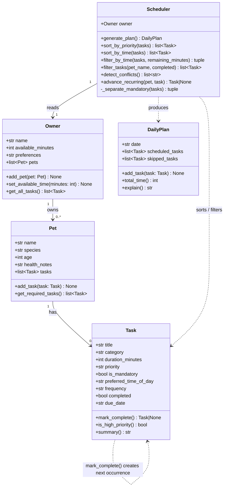

# PawPal+ — Final Class Diagram (Mermaid.js)

Paste the block below into [https://mermaid.live](https://mermaid.live) and export as PNG to produce `uml_final.png`.

## Key relationships

| Relationship | Type | Description |
|---|---|---|
| Owner → Pet | Composition | Owner holds a list of pets; pets don't exist without an owner in this system |
| Pet → Task | Composition | Each pet owns its task list; tasks are added via `Pet.add_task()` |
| Scheduler → Owner | Association | Scheduler reads the owner and all nested pets/tasks at plan time |
| Scheduler → DailyPlan | Dependency | `generate_plan()` creates and returns a new DailyPlan each call |
| Task → Task | Self-reference | `mark_complete()` returns a new Task instance for the next recurrence |
